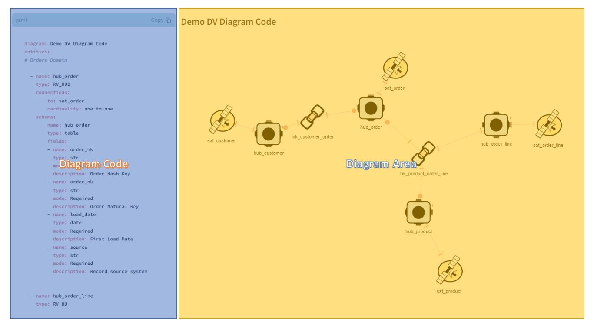

## Data Vault Diagram Tool Areas


### Code Area

This is our **work area**, here it is where you will input code that will be used to render the diagram.

The code editor is initially loaded with a template but further in the document, it is explained the pattern expected.

Code editor supports two types of configuration languages (YAML and JSON). It can be changed the highlight syntax support in the side bar.

### Diagram Area
**Presentation area:** Here it is where the diagram comes to life and draws itself based on the code provided. The graph is automatically displayed and each entity can be dragged for a different position to rearrange.

Cardinality in the edges when defined in the code is represented by a bar ▎when cardinality is 1 (one) and by a circle ⚫ when cardinality is N (many).

By click on the node it will open below of the diagram the table of details of the entity which can be changed by the select box also.

## Code Pattern
Tool is designed to read the code editor, get code text, parse to object model, run all validations and render the graph. But to ensure the correct work of it, the code is expected to follow a pattern

### Data Vault Diagram Tool Models

#### **DataVaultModel**
Base data class represents Diagram Config entity.

| Name      | Type               | Description                               |
|-----------|--------------------|-------------------------------------------|
| diagram   | str                   | The diagram associated with the model. |
| entities  | List[[DataVaultEntity](#datavaultentity)] | List of entities associated with the model. |
---

#### **DataVaultEntity**
Base data class represents Data Vault entity.

| Name           | Type                           | Description                                 |
|----------------|--------------------------------|---------------------------------------------|
| id             | str                            | The ID of the entity.                       |
| type           | str                            | The type of the entity. Type are confront with allowed list. |
| label          | str                            | The label of the entity. Must follow naming convention|
| description    | str, optional                  | A description of the entity.                |
| entity_schema  | [EntitySchema](#entityschema), optional         | Describe a phisical database objects.      |
| connections    | List[[Connection](#connection)], optional     | List of connections associated with entity. |
---
#### **EntitySchema**

Data class representing an entity (can be a table, view, file...).

| Name        | Type                           | Description                            |
|-------------|--------------------------------|----------------------------------------|
| name        | str                            | The name of the entity.                |
| type        | str                            | The type of the entity.                |
| description | str, optional                  | A description of the entity.           |
| fields      | List[[EntityFieldSchema](#entityfieldschema)], optional | List of fields associated with entity. |

#### **EntityFieldSchema**

Data class representing a field of an entity.

| Name         | Type               | Description                                |
|--------------|--------------------|--------------------------------------------|
| name         | str                | The name of the field.                      |
| type         | str, optional      | The type of the field.                      |
| mode         | str, optional      | The mode of the field.                      |
| description  | str, optional      | A description of the field.                |
---

#### **Connection**

Base data class represents Connection entity.

| Name        | Type                     | Description                            |
|-------------|--------------------------|----------------------------------------|
| target      | str or List[str], alias="to" | The target of the connection.      |
| cardinality | str, optional            | The cardinality of the connection.     |

---
#### Data Vault Diagram Samples


YAML Example:
```yaml
diagram: Diagram Name # [Optional]
entities: # List of Entities
    - id: str
      label: str # Validate for Naming Convention
      type: str # Validate for Type Allowed
      description: str #[Optional]
      entity_schema: #[Optional]
        name: str
        type: str
        description: str #[Optional]
        fields: #[Optional]
        - name: str
          type: str
          mode: str #[Optional]
          description: str #[Optional]
      connections: #[Optional]
        - to: str
          cardinality: str # [Optional] Validate for Cardinality Option
```


JSON Example:
```json
{
  "diagram": "Diagram Name",
  "entities": [
    {
      "id": "str",
      "label": "str",
      "type": "str",
      "description": "str",
      "entity_schema": {
        "name": "str",
        "type": "str",
        "description": "str",
        "fields": [
          {
            "name": "str",
            "type": "str",
            "mode": "str",
            "description": "str"
          }
        ]
      },
      "connections": [
        {
          "to": "str",
          "cardinality": "str"
        }
      ]
    }
  ]
}
```

## Data Vault Validation
To make this tool even more useful, some data model validations is applied to be sure that model follows some minimum criteria of quality and data modeller life easier. The list of validations the tools is applying (so far) are described below, find me in github and open a issue if you want include new ones or find some issue, your help will be very important.

### Validate Naming Covention
* **Model:** DatavaVaultEntity
* **Field:** label
* **Rule(s):** Name needs to start with the valid naming convention accordingly with the type (see column Naming Convention on [Data Vault Entity Options](#data-vault-entity-options))

### Validate Type
* **Model:** DatavaVaultEntity
* **Field:** type
* **Rule(s):** Type needs to be one of the allowed type (see column Type on [Data Vault Entity Options](#data-vault-entity-options))

### Validate Connections
* **Model:** DatavaVaultEntity
* **Field:** connections
* **Rule(s):**
    * Entity of group type Satellite can not connect with another Satellite.